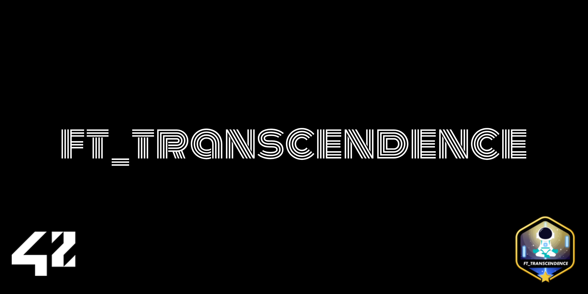

# 🃏 ft_transcendence - Online Casino

*This project has been created as part of the 42 curriculum by dsatge, pgrellie, acarpent, sidiallo, enschnei.*

  

  

## ##Technos

  
  
  
  
  
  
  

## ##Description
**Project Name:** Casino_Transcendance

This project is the final capstone of the 42 curriculum. We have developed a **real-time multiplayer Casino platform**. The objective is to provide a comprehensive casino experience where users can play against the house (the dealer) or join communal tables, all while managing their virtual token wallets.

**Key Features:**
* **Blackjack Game:** System with bet, keep and double down.
* **Multiplayer :** 5 people can join and play together.
* **Virtual cash :** Token system, history of win/lose and ranking of the biggest bettors.
* **Languages:** 3 languages available (Français, English, Español).

---

## ## Team Information

| Login | Role | Responsibilities |
| :--- | :--- | :--- |
| **pgrellie** | Product Owner | Lead the idea of the project, make the back, give the task. |
| **dsatge** | Projet Manager | Back developper, set the reunion and make the link with everybody. |
| **acarpent** | Technical Lead/Architect | Creat the front architecture. |
| **sidiallo** | Developers | Support dev back. |
| **enschnei** | Developers | Translate section, readme. |

---

## ## Project Management
* **Organisation :** Every friday we make a call or real team reunion for ask about the next task for the next week and check if all is good.
* **Outils :** [GitHub Projects / Trello] pour la gestion des sprints.
* **Communication :** [Discord] for the share of documentation and plan reunion.

---

## ## Technical Stack
* **Frontend:** [React / TypeScript / Tailwind] – Chosen to handle dynamic card rendering and real-time UI updates without page reloads (SPA).
* **Backend:** [Express / TypeScript] – Manages the complex Blackjack game logic, rules validation, and token persistence.
* **Database:** **PostgreSQL** – Crucial for storing user data and token transactions with high security and data integrity.
* **Real-time:** **WebSockets** – Used to instantly synchronize dealer actions and player moves across all connected clients.
* **Containerization:** **Docker** – Provides isolated environments for the frontend, backend, and database services via Docker Compose.
* **Justification:** We chose this stack to ensure a clear separation between the game engine logic and the user interface, while maintaining the high performance required for real-time gambling mechanics.

---

## ## Database Schema
The database is structured around the following main entities:
* **Users:** model User, model Friendship, model Transaction, model BlackjackRoundHistory (/42_TRANSCENDENCE/backend/prisma/schema.prisma)
* **Hands/Games:** History of played hands, including dealt cards, bets placed, and outcomes (Win/Loss/Push).
* **Transactions:** A detailed log of gains and losses to prevent any data corruption or unauthorized balance changes.

---

## ## Features List

| Feature | Member(s) | Description |
| :--- | :--- | :--- |
| **Blackjack game** | All | Card dealing logic, point calculation (Ace = 1/11), and dealer's turn automation. |
| **Mobile Responsive** | acarpent | Website responsivness. |
| **Account & friends** | sidiallo | Add friends list, Stats, Scoreboard, Balance and online status |
| **Language** | enschnei | 3 language available on the website (English, French and Spanish). |
| **User Management** | dsatge, pgrellie | Create user account, mail verification etc... | 

---

## ## Modules

## MAJOR MODULES (2 pts each)

### 1. Web - Backend Framework ✅ (2 pts)
**Status:** Fully Implemented
- **Technology:** Express.js + TypeScript
- **Files:** `backend/srcs/app.ts`, `backend/srcs/server.ts`
- **Description:** Express server with TypeScript for type safety, middleware setup (auth, CORS, helmet), and modular route organization
- **Justification:** Essential for centralizing game logic, authentication, and API endpoints

### 2. Web - Frontend Framework ✅ (2 pts)
**Status:** Fully Implemented
- **Technology:** React + TypeScript + Vite + Tailwind CSS
- **Files:** `Frontend/src/App.tsx`, `Frontend/src/pages/`, `Frontend/src/components/`
- **Description:** Modern SPA with React Router for navigation, component-based architecture, and Tailwind CSS for styling
- **Justification:** Provides dynamic UI updates without page reloads and excellent developer experience with HMR

### 3. Web - Real-time Features (WebSockets) ✅ (2 pts)
**Status:** Fully Implemented
- **Technology:** Socket.IO (server & client)
- **Files:**
  - Backend: `backend/srcs/casin/blackjack/socket/bj21Socket.ts`
  - Frontend: `Frontend/src/features/blackjack/BlackjackSocket.ts`
  - Presence: `backend/srcs/modules/presence/presenceSocket.service.ts`
- **Real-time Updates:**
  - Blackjack game state synchronization across all connected players
  - Wallet updates (bets and payouts) in real-time
  - User presence tracking (online/offline status)
  - Table state broadcasts
  - Round results notifications
- **Justification:** Critical for multiplayer gaming experience and live user interactions

### 4. Web - User Interaction (Friends + Profile) ✅ (2 pts)
**Status:** Fully Implemented
- **Technology:** REST API with proper CRUD operations
- **Core Features:**
  - **Friends System:**
    - Send/accept friend requests: `POST /api/friends/request`, `PATCH /api/friends/request/respond`
    - Get friends list: `GET /api/friends`
    - Check friendship status: `GET /api/friends/check-friendship/:friendId`
    - Remove friends: `DELETE /api/friends/friend`
    - View pending/sent requests
  - **Profile System:**
    - Get user profile: `GET /api/profile`
    - Update profile: `PATCH /api/profile` (with avatar upload)
    - Search users: `GET /api/profile/search`
    - View Blackjack stats: `GET /api/profile/blackjack-stats`
- **Files:** `backend/srcs/modules/friends/`, `backend/srcs/modules/profile_user/`
- **Justification:** Enables social interactions and user management within the platform

### 5. Gaming - Web-based Game (Blackjack) ✅ (2 pts)
**Status:** Fully Implemented
- **Technology:** Socket.IO multiplayer, game engine with complete rules
- **Game Features:**
  - Complete Blackjack rules implementation
  - Hit, Stand, Double Down actions
  - Automatic dealer play
  - Hand value calculation (Ace handling as 1 or 11)
  - Win/Loss/Push/Bust/Blackjack outcomes
  - Real-time multiplayer support
- **Files:**
  - `backend/srcs/casin/blackjack/roundEngine.ts` - Game logic
  - `backend/srcs/casin/blackjack/deck.ts` - Deck management
  - `Frontend/src/pages/Blackjack.tsx` - UI
- **Database:** `BlackjackRoundHistory` model for match tracking
- **Justification:** Core gaming experience with proper rule validation on backend

### 6. Gaming - Multiplayer 3+ Players ✅ (2 pts)
**Status:** Fully Implemented
- **Maximum Players:** 5 concurrent players per table
- **Implementation:**
  - Multiple seat management in `tableManager.ts`
  - Simultaneous turn handling
  - Synchronized game state for all players
  - Proper turn order management
- **Justification:** Enables social gaming and increases engagement

### 7. User Management - Standard User Management ✅ (2 pts)
**Status:** Fully Implemented
- **Features:**
  - User registration: `POST /api/auth/signup`
  - User login: `POST /api/auth/login`
  - Email verification: `POST /api/auth/verify-email`
  - Password reset: `POST /api/auth/forgot-password`
  - Profile management (update user info)
  - Avatar upload and management
  - Friends list management
  - Online status tracking
- **Security:**
  - Password hashing with bcrypt
  - JWT token-based authentication
  - Rate limiting on auth routes
  - Email verification for new accounts
- **Files:** `backend/srcs/modules/auth/`, `backend/srcs/modules/profile_user/`
- **Database:** User model with email, username, avatar, balance fields
- **Justification:** Essential user lifecycle management and security

---

## MINOR MODULES (1 pt each)

### 1. Web - ORM (Prisma) ✅ (1 pt)
**Status:** Fully Implemented
- **Technology:** Prisma ORM with PostgreSQL
- **Files:** `backend/prisma/schema.prisma`
- **Models:** User, Friendship, Transaction, BlackjackRoundHistory
- **Justification:** Provides type-safe database access, automatic migrations, and data integrity

### 2. User Management - Game Statistics ✅ (1 pt)
**Status:** Fully Implemented
- **Tracking:** Wins, losses, best hands, games played
- **Storage:** `BlackjackRoundHistory` table with:
  - User ID
  - Net amount (profit/loss)
  - Cause (victory, defeat, bust, push, blackjack)
  - Timestamp
- **Access:** `GET /api/profile/blackjack-stats`
- **Display:** Leaderboard with win counts: `GET /api/leaderboard`
- **Justification:** Enables progression tracking and competitive play

### 3. Accessibility - Multiple Languages (i18n) ✅ (1 pt)
**Status:** Fully Implemented
- **Technology:** react-i18next
- **Languages Supported:** 3+
  - French
  - English
  - Spanish
- **Coverage:**
  - All user-facing UI text
  - Game elements
  - Error messages
  - Legal/Privacy pages
  - Responsible gaming page
- **Files:**
  - `Frontend/src/i18n.ts` - Translation definitions
  - `Frontend/src/components/LanguageMenu.tsx` - Language switcher
- **Implementation:** Global translation context, language switcher in header
- **Justification:** Ensures global accessibility and inclusivity

### 4. Authentication & Security Features ✅ (Implicit benefits)
- **Password Security:** bcrypt hashing with salt
- **JWT Tokens:** Access and refresh token management
- **Socket Authentication:** JWT validation for WebSocket connections
- **Rate Limiting:** Implemented on auth routes
- **HTTPS:** Configured in nginx for production
- **CORS:** Properly configured for frontend-backend communication

**Total Points: 17 pts**

---

## ## Individual Contributions

* **pgrellie:** Developed all the game (Backend oriented).
* **dsatge:** Makefile, lead the group, social abilities, Prisma.
* **acarpent:** Developpe Frontend architecture, User experience, coach Frontend.
* **sdiallo:** Major user management developement.
* **enschnei:** Translate service, readme writting.
